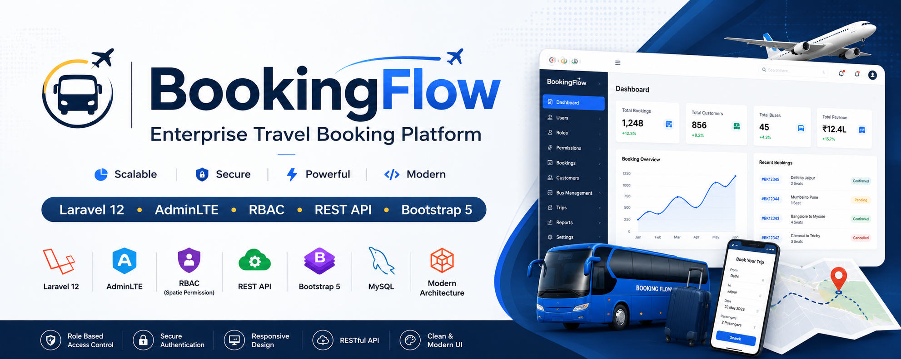
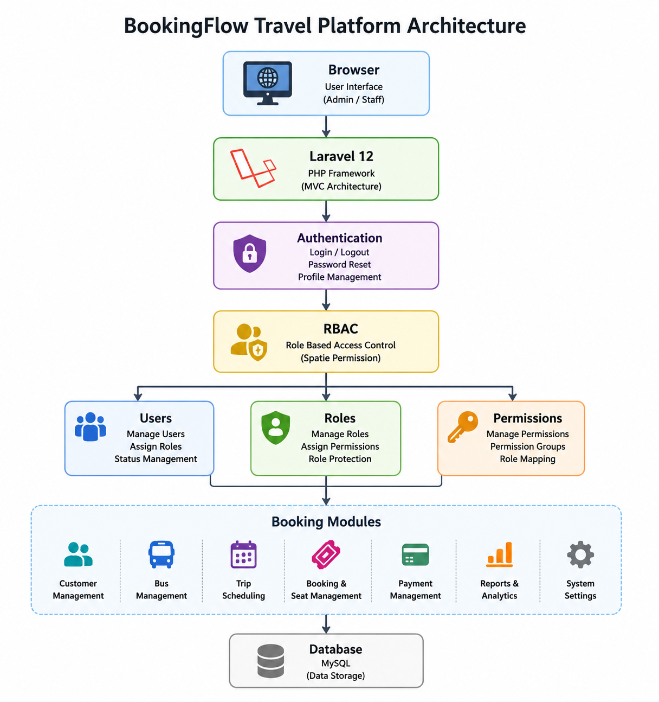
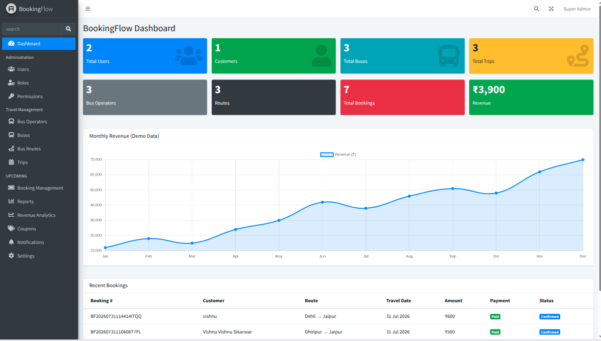
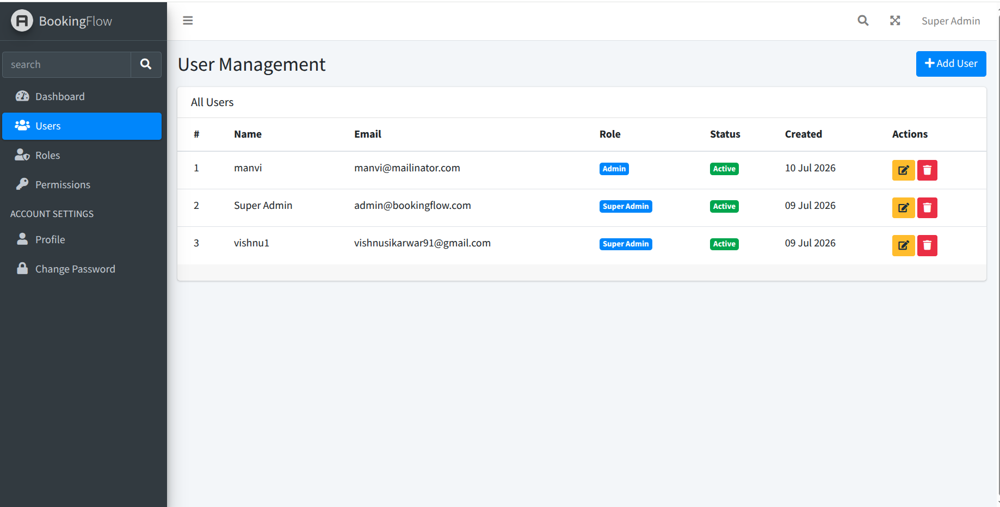
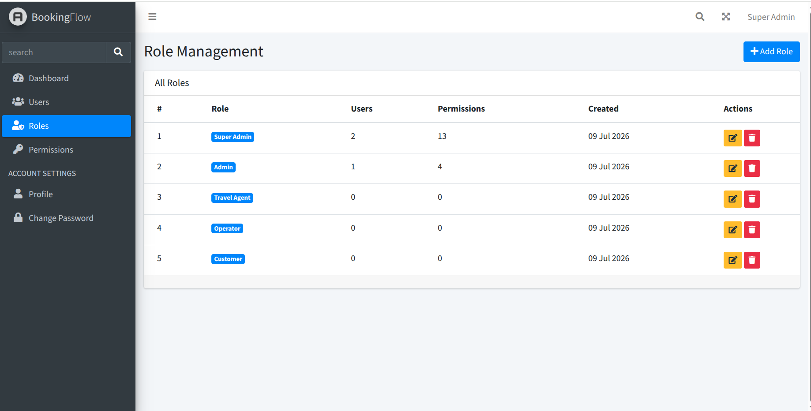
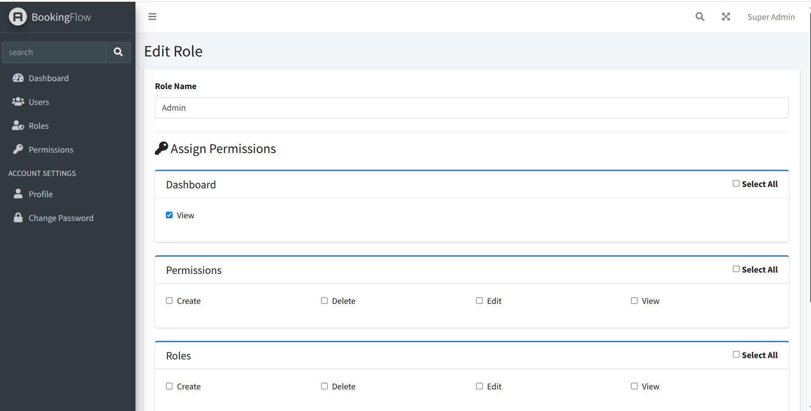
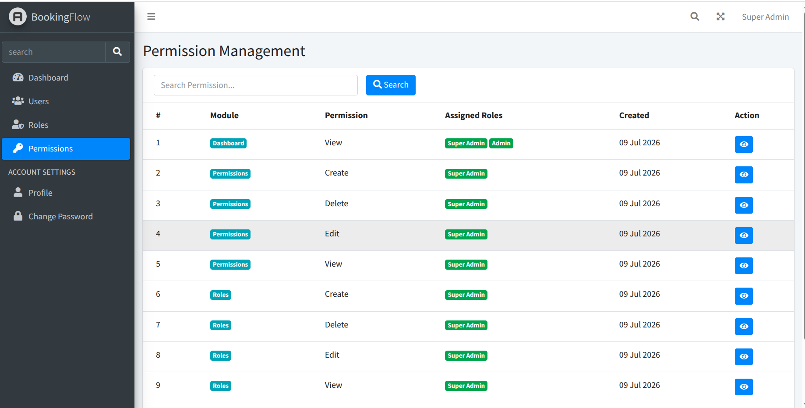
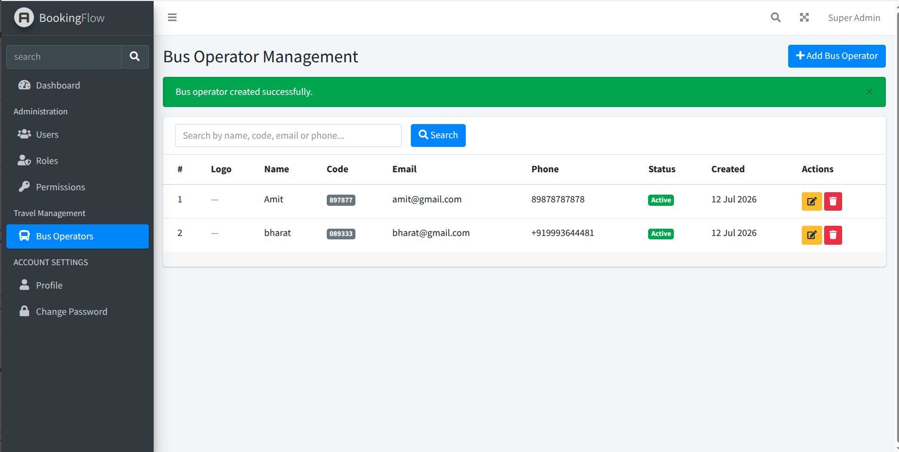
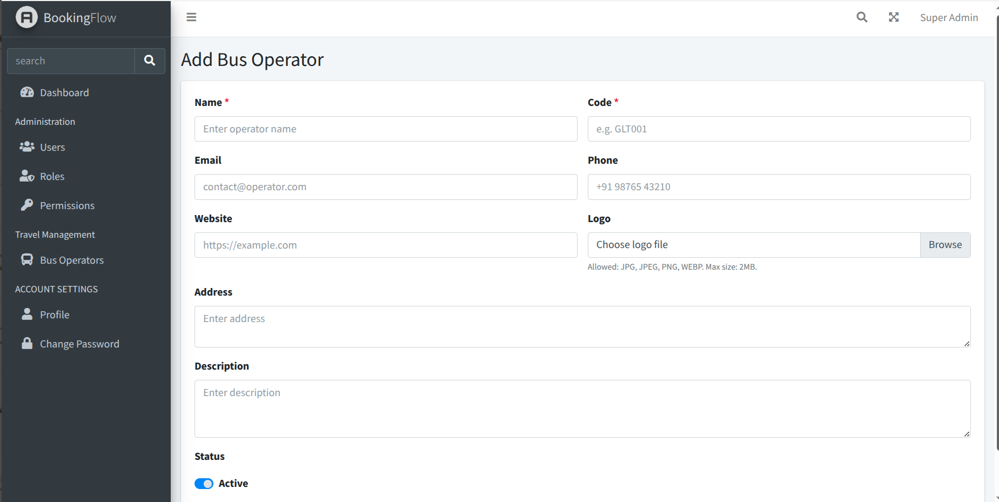

<p align="center">
  
</p>

# 🚍 BookingFlow Travel Platform

A modern travel booking platform built with Laravel 12 featuring Role-Based Access Control (RBAC), AdminLTE dashboard, and a scalable architecture for travel agencies and booking businesses.

---

## 🎯 Project Goals

BookingFlow is being developed as a production-quality Laravel SaaS application to demonstrate:

- Clean Architecture
- Service Layer Pattern
- Role-Based Access Control
- Travel Booking Domain
- Modern Laravel 12 Best Practices

## ✨ Features

### 🔐 Authentication
- Secure Login & Logout
- Profile Management
- Password Reset

### 👥 User Management
- Create, Edit & Delete Users
- Active / Inactive Status
- Search & Pagination
- Role Assignment

### 🛡 Role Management
- Complete CRUD
- Assign Multiple Permissions
- Protected System Roles

### 🔑 Permission Management
- View Permissions
- Search Permissions
- Role Mapping

### 🚌 Bus Operator Management
- Complete CRUD
- Search & Pagination
- Soft Deletes
- Permission-Based Access
- AdminLTE Interface
- Validation with Form Requests
- Service Layer Architecture

### 🔒 Role-Based Access Control (RBAC)
- Spatie Laravel Permission
- Route Protection
- Dynamic Sidebar
- Permission Based UI
- Super Admin Access

### 🎨 Admin Dashboard
- AdminLTE UI
- Responsive Layout
- Bootstrap 5

# 🏗️ System Architecture

<p align="center">
  
</p>

---

---

# 📸 Screenshots

## Dashboard



## User Management



## Role Management





## Permission Management



## Bus Operator Management





---

# 🚀 Tech Stack

| Technology                | Version |
| ------------------------- | ------- |
| Laravel                   | 12      |
| PHP                       | 8.4     |
| MySQL                     | 8       |
| Bootstrap                 | 5       |
| AdminLTE                  | 3       |
| Spatie Laravel Permission | Latest  |
| Laravel Pint              | Latest  |


---

# 📂 Project Structure

```text
app/
 ├── Http/
 │    ├── Controllers/
 │    └── Middleware/
 │
 ├── Models/
 │
resources/
 ├── views/
 │    ├── admin/
 │    ├── users/
 │    ├── roles/
 │    └── permissions/

routes/
database/
```

---

# ⚙️ Installation

```bash
git clone https://github.com/vishnu91sikarwar/bookingflow-travel-platform.git

cd bookingflow-travel-platform

composer install

cp .env.example .env

php artisan key:generate

php artisan migrate

php artisan db:seed

php artisan serve
```


# 🛣 Roadmap

## ✅ Version 1.0
- Authentication
- Dashboard
- User CRUD
- Role CRUD
- Permission Management
- RBAC

## 🚧 Version 1.1
- ✅ Bus Operators
- ⬜ Buses
- ⬜ Routes
- ⬜ Trips

## 🚧 Version 1.2
- Payments
- Reports
- Notifications
- Activity Logs

## 🚧 Version 2.0
- Multi Company Support
- SaaS Version
- API
- Mobile App Integration

---


## 👨‍💻 Author

**Vishnu Singh Sikarwar**

Senior Laravel Full Stack Developer

- GitHub: https://github.com/vishnu91sikarwar
- Email: monu91sikarwar@gmail.com