<p align="center">
  
</p>

# 🚍 BookingFlow Travel Platform

A modern travel booking SaaS platform built with Laravel 12 featuring Role-Based Access Control (RBAC), AdminLTE dashboard, customer booking workflow, Stripe payment integration, and a scalable architecture for travel agencies, bus operators, and booking businesses.

---

## 🎯 Project Goals

BookingFlow is being developed as a production-quality Laravel SaaS application to demonstrate:

- Clean Architecture
- Service Layer Pattern
- Role-Based Access Control
- Travel Booking Domain
- Customer Booking Experience
- Payment Gateway Integration
- Scalable SaaS Architecture
- Modern Laravel 12 Best Practices

## ✨ Features

### 🔐 Authentication

- Secure Login & Logout
- Customer Registration
- Profile Management
- Password Reset
- Role-Based Login Redirect


### 👥 User Management

- Create, Edit & Delete Users
- Active / Inactive Status
- Search & Pagination
- Role Assignment
- Multiple User Types:
  - Super Admin
  - Admin
  - Operator
  - Travel Agent
  - Customer


### 🛡 Role Management

- Complete CRUD
- Assign Multiple Permissions
- Protected System Roles


### 🔑 Permission Management

- View Permissions
- Search Permissions
- Role Mapping
- Permission-Based Access Control


### 🚌 Bus Operator Management

- Complete CRUD
- Search & Pagination
- Soft Deletes
- Permission-Based Access
- AdminLTE Interface
- Validation with Form Requests
- Service Layer Architecture


### 🚌 Bus Management

- Complete Bus CRUD
- Bus Operator Mapping
- Bus Details Management
- Seat Configuration Support


### 🛣 Routes Management

- Create & Manage Routes
- Source & Destination Management
- Route Assignment


### 🚍 Trips Management

- Create & Manage Trips
- Bus & Route Mapping
- Departure Schedule Management
- Fare Management


### 🎟 Customer Booking Workflow

- Bus Search
- Trip Listing
- Seat Selection
- Real-Time Booked Seat Blocking
- Passenger Details
- Booking Review
- Booking Confirmation
- Booking Reference Generation


### 💳 Payment Integration

- Stripe Checkout Integration
- Test Card Payment Flow
- Payment Status Tracking
- Secure Payment Processing
- Booking Confirmation After Successful Payment


### 📋 Customer Features

- Customer Dashboard
- My Bookings
- Booking Details
- Ticket Download
- Guest Booking Lookup


### 🔒 Role-Based Access Control (RBAC)

- Spatie Laravel Permission
- Route Protection
- Dynamic Sidebar
- Permission Based UI
- Super Admin Access


### 🎨 Admin Dashboard

- AdminLTE UI
- Responsive Layout
- Bootstrap 5
- Management Dashboard


# 🏗️ System Architecture

<p align="center">
  
</p>

---

---

# 📸 Screenshots

## 🎨 Admin Dashboard


## 👥 User Management


## 🛡 Role Management


## 🔑 Permission Management


## 🚌 Bus Operator Management


## 🚌 Bus Management

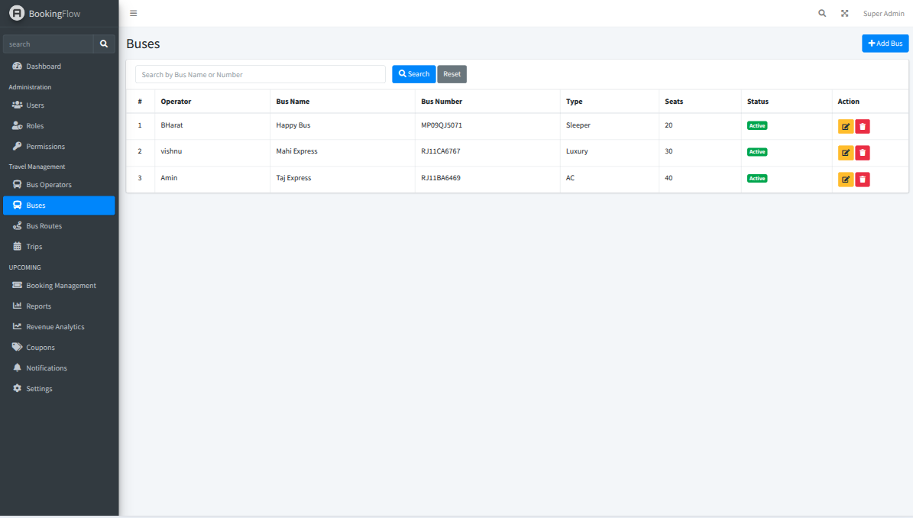

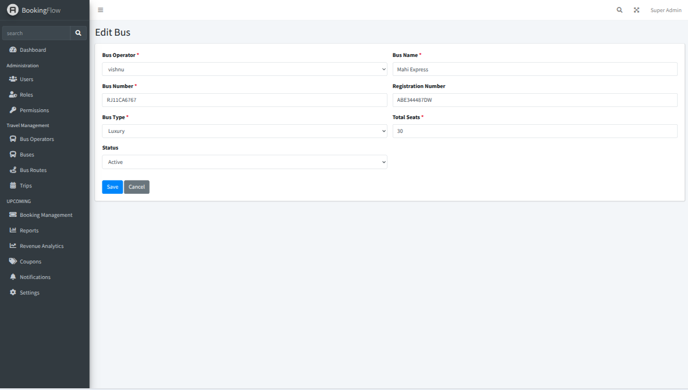


## 🛣 Routes Management

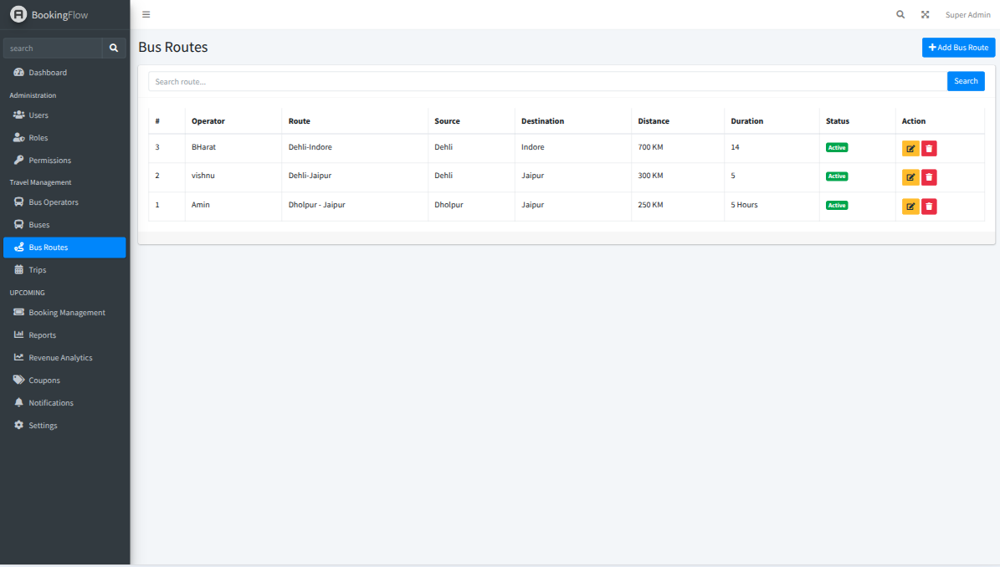

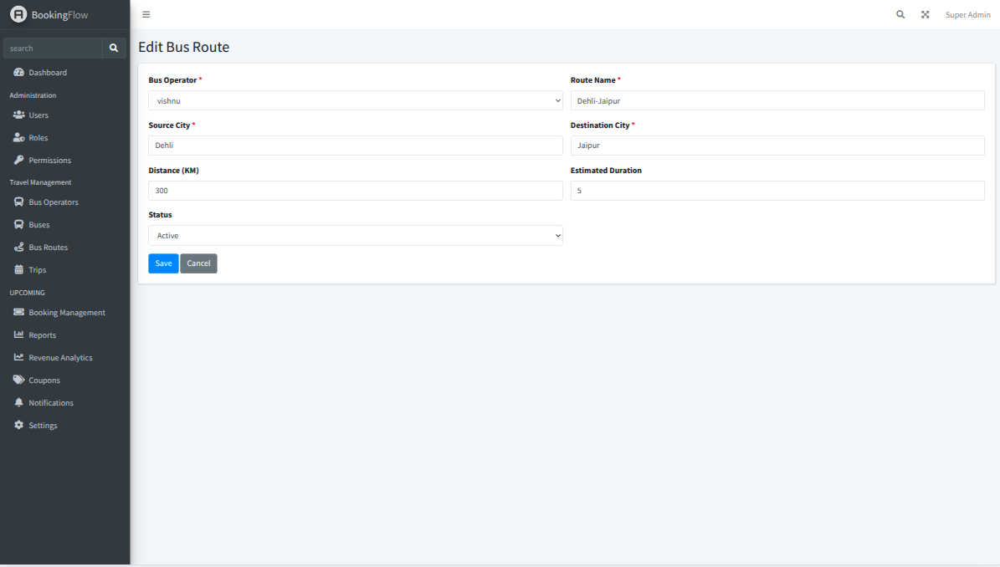


## 🚍 Trips Management

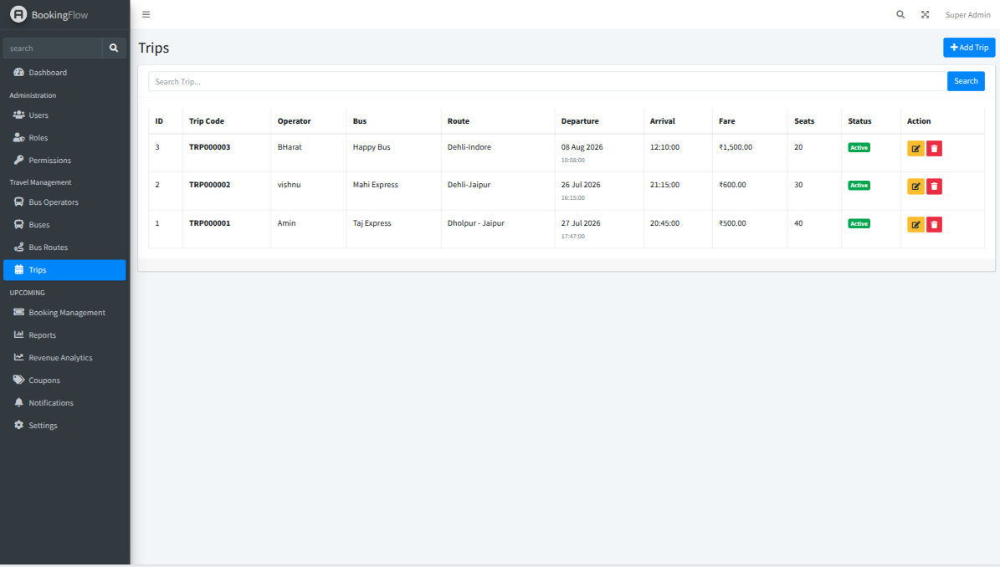

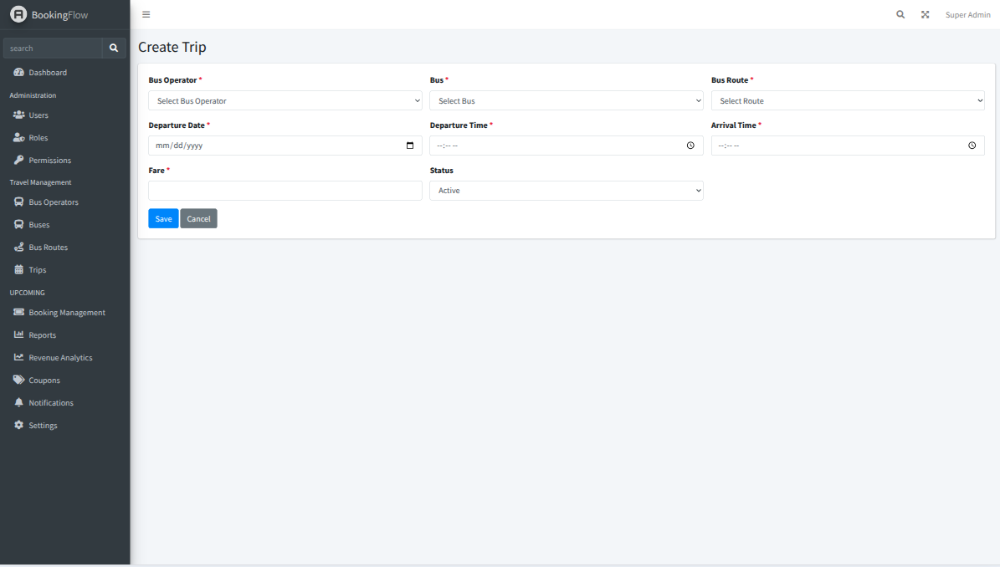


## 🎟 Customer Booking Flow

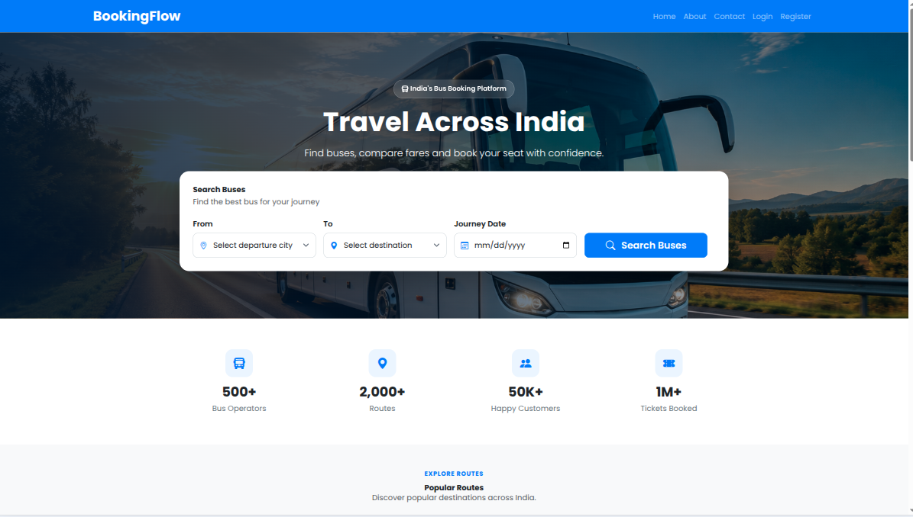

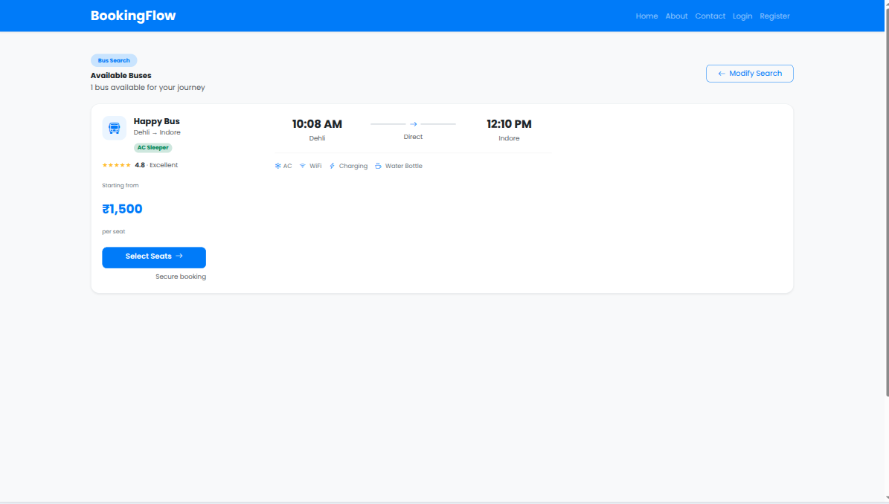

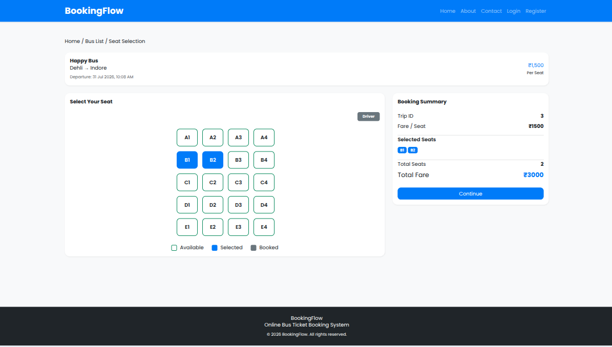

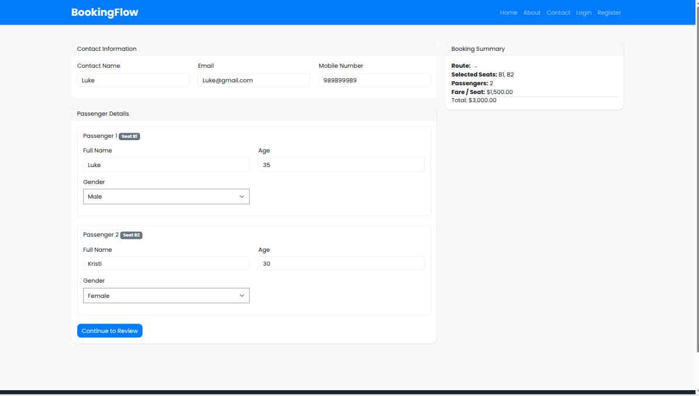

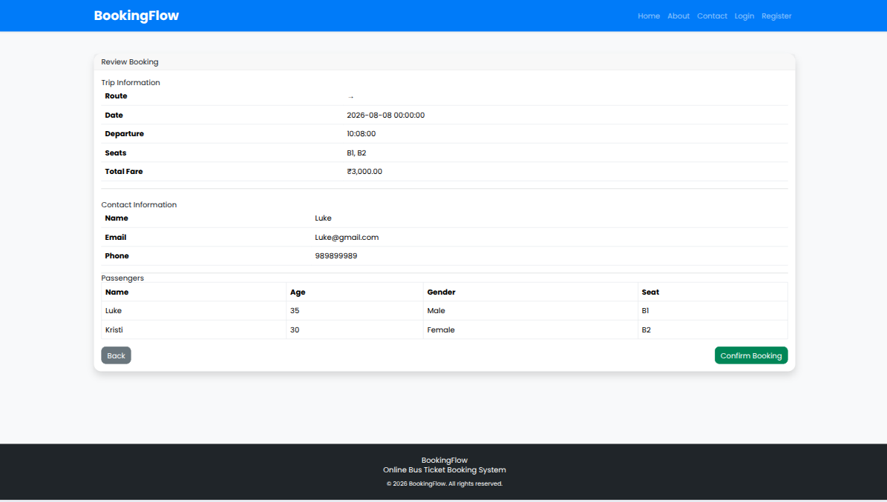


## 💳 Payment Integration

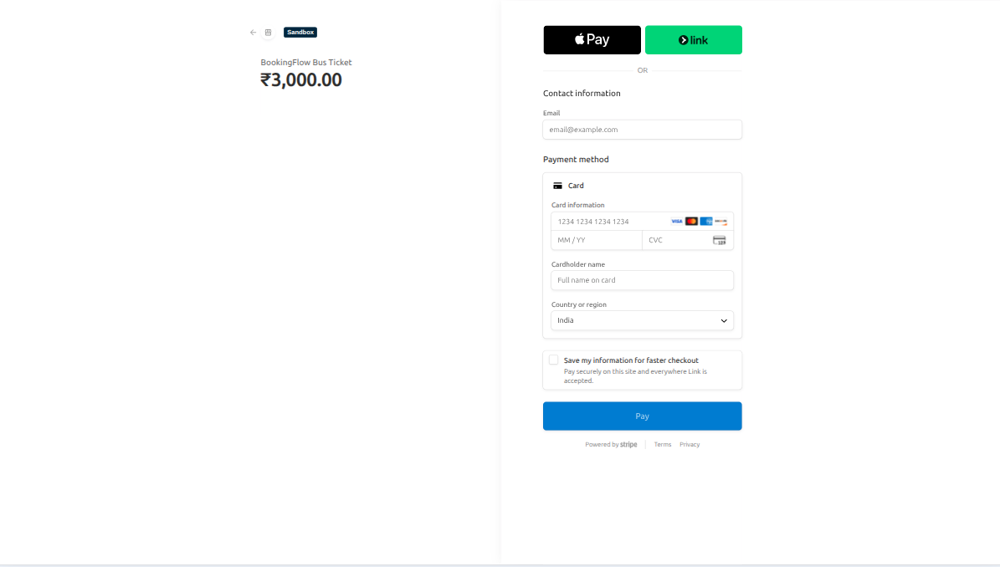

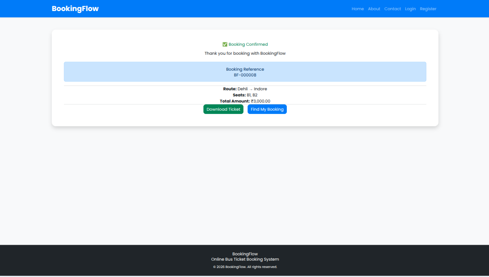


## 📋 Customer Portal


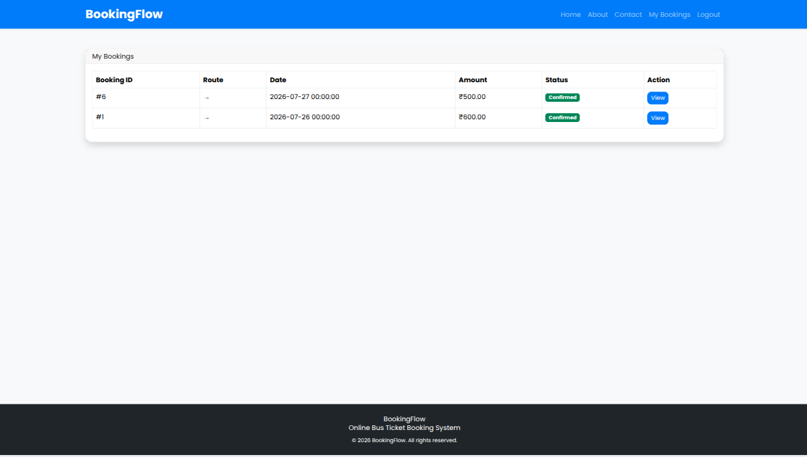

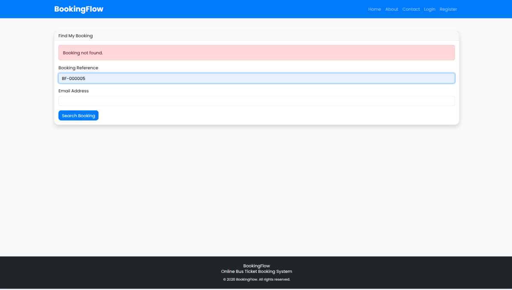

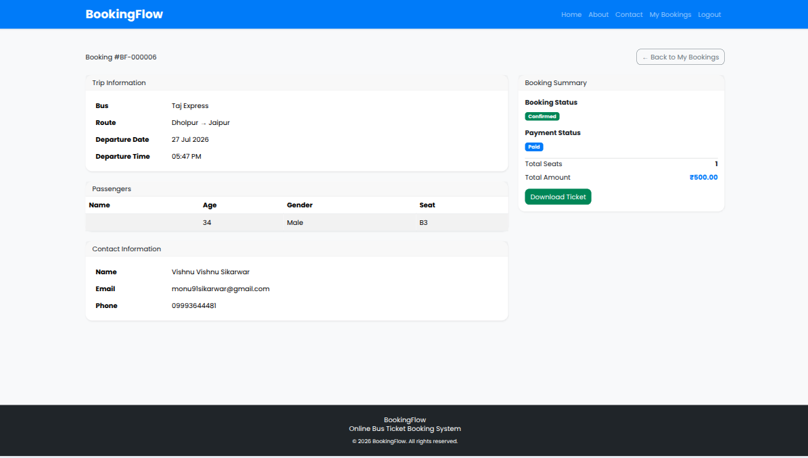

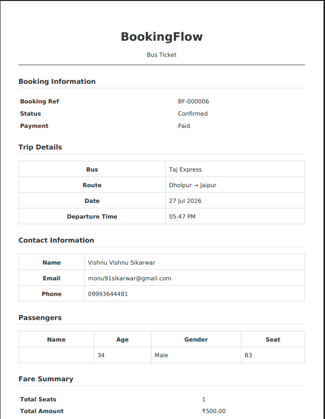


---

# 🚀 Tech Stack

| Technology | Version |
|------------|---------|
| Laravel | 12 |
| PHP | 8.2+ |
| MySQL | 8.0 |
| Blade | Latest |
| Vue.js | 3 |
| Bootstrap | 5 |
| AdminLTE | 3 |
| JavaScript (ES6+) | Latest |
| jQuery | Latest |
| Vite | Latest |
| Laravel Breeze | Latest |
| Spatie Laravel Permission | Latest |
| Stripe Checkout | Latest |
| Laravel Pint | Latest |
| Composer | Latest |
| Git & GitHub | Latest |

---

# 📂 Project Structure

```text
app/
├── Http/
│   ├── Controllers/
│   │   ├── Admin/
│   │   ├── Frontend/
│   │   └── Auth/
│   │
│   ├── Middleware/
│   └── Requests/
│
├── Models/
│
├── Services/
│
└── Providers/

resources/
├── views/
│   ├── admin/
│   ├── frontend/
│   ├── auth/
│   ├── layouts/
│   └── components/
│
├── js/
│   └── components/
│
└── css/

routes/
├── web.php
└── auth.php

database/
├── migrations/
├── seeders/
└── factories/

public/
docs/
storage/
```

---

# ⚙️ Installation & Setup

## Prerequisites

Make sure you have installed:

- Docker
- Docker Compose
- Git


## Clone Repository

```bash
git clone https://github.com/vishnu91sikarwar/bookingflow-travel-platform.git

cd bookingflow-travel-platform
```
## Environment Setup
```bash
cp .env.example .env
```

DB_CONNECTION=mysql
DB_HOST=mysql
DB_PORT=3306
DB_DATABASE=bookingflow
DB_USERNAME=bookingflow
DB_PASSWORD=secret

## Build Docker Containers
```bash
docker compose build
```
## Start Application
```bash
docker compose up -d
```
## Install PHP Dependencies
```bash
docker compose exec app composer install
```
## Install Frontend Dependencies
```bash
docker compose exec app npm install
```
## Generate Application Key
```bash
docker compose exec app php artisan key:generate
```
## Run Database Migration & Seeders
```bash
docker compose exec app php artisan migrate --seed
```
## Build Frontend Assets
```bash

docker compose exec app npm run build
```
## Access Application

http://localhost:8000

## Useful Docker Commands
Start containers:
```bash
docker compose up -d
```
Stop containers:
```bash
docker compose down
```
View container status:
```bash
docker compose ps
```
View logs:
```bash
docker compose logs
```
Run Laravel Artisan commands:
```bash
docker compose exec app php artisan
```


# 🛣 Roadmap

## ✅ Version 1.0 — Core Platform

- Authentication
- User Management
- Dashboard
- Role Management
- Permission Management
- Role-Based Access Control (RBAC)
- AdminLTE Dashboard
- Bus Operator Management
- Bus Management
- Routes Management
- Trips Management
- Customer Search Flow
- Seat Selection
- Passenger Details
- Booking Confirmation
- Dummy Payment Gateway Integration


## 🚧 Version 1.1 — Booking Enhancement

- Real Payment Gateway Integration
- Booking Email Notifications
- PDF Ticket Generation
- Booking History Improvements
- Reports & Analytics
- Activity Logs


## 🚧 Version 1.2 — SaaS Features

- Multi Company Support
- Travel Agency Management
- Subscription Plans
- API Platform
- Mobile App Integration


## 🚧 Version 2.0 — Enterprise Features

- Advanced Reporting
- Queue Based Processing
- Real-time Notifications
- Microservice Ready Architecture
- Cloud Deployment
- CI/CD Automation

---

# 👨‍💻 Author

**Vishnu Singh Sikarwar**

Senior Laravel Full Stack Developer

Specialized in building scalable SaaS platforms, API integrations, and cloud-ready Laravel Vue Js applications.

### Connect

- Portfolio: https://vishnuuk.in
- GitHub: https://github.com/vishnu91sikarwar
- Email: monu91sikarwar@gmail.com
